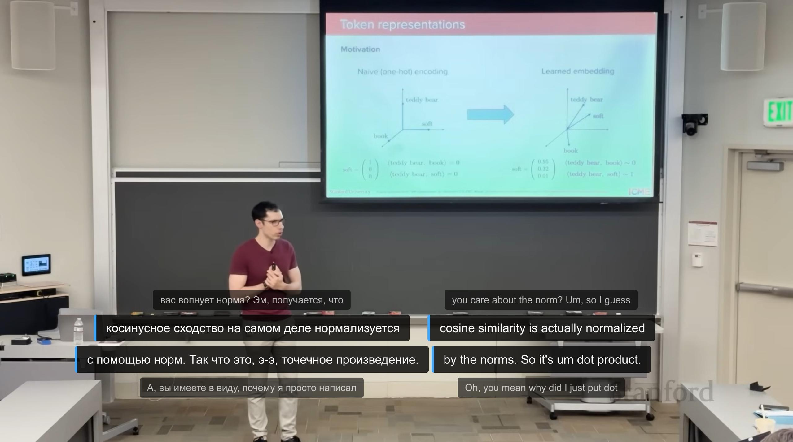

# youtube-dual-srt-renderer
Firefox extension for displaying two custom SRT subtitle tracks simultaneously on YouTube videos with time window preview (shows current and upcoming subtitles)



## Возможности

- Отображение в видео пользовательских субтитров в формате **.srt**
- Две дорожки:
  - слева — перевод (например, русский)
  - справа — оригинальный язык
- Расширенное «окно времени»: отображаются субтитры за немного до и несколько секунд после текущего момента
- Подсветка текущего субтитра (более яркий фон и вертикальная полоска слева)
- Кнопки интегрированы в правый блок управления YouTube и выглядят как обычные иконки плеера
- Каждой дорожке соответствует своя кнопка и свой SRT‑файл, они работают независимо

## Установка (режим разработчика)

1. Склонируйте репозиторий или скачайте файлы в отдельную папку
2. Убедитесь, что в папке есть `manifest.json`, `content.js`
3. В Firefox откройте страницу `about:debugging`
4. Перейдите в раздел **This Firefox** → **Load Temporary Add-on…**
5. Выберите файл `manifest.json` в папке расширения
6. Откройте любое видео на YouTube — в правой части панели управления появятся две новые кнопки.

## Использование

1. Откройте нужное видео на YouTube
2. Загрузите SRT‑файл с переводом (левая кнопка)
3. Загрузите SRT‑файл с оригиналом или любым другим вторым языком (правая кнопка)
4. Во время воспроизведения:
   - текущий субтитр подсвечивается
   - сверху/снизу будут отображаться соседние фразы, попадающие в окно времени

При необходимости можно загрузить только одну дорожку (например, только перевод) — вторая кнопка и панель не будут мешать.

SRT-файлы нужно предварительно скачать через сторонние сервисы (например, этот бот в Telegram @click_downloader_bot)

## Настройка под себя

В `content.js` можно легко изменить поведение:

### Размер окна по времени

В функции, отвечающей за отрисовку субтитров, отредактируйте константы:

```
const TIME_WINDOW_BEFORE = 1; // секунды до текущего момента
const TIME_WINDOW_AFTER = 5; // секунды после текущего момента
```

## Ограничения
- Работает только на страницах YouTube в Firefox
